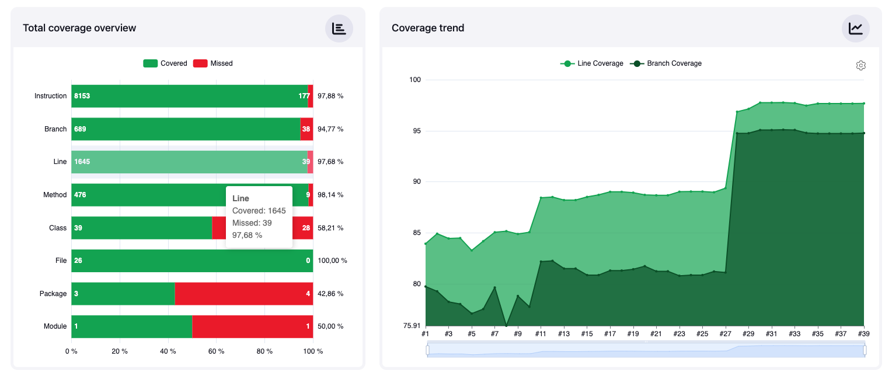
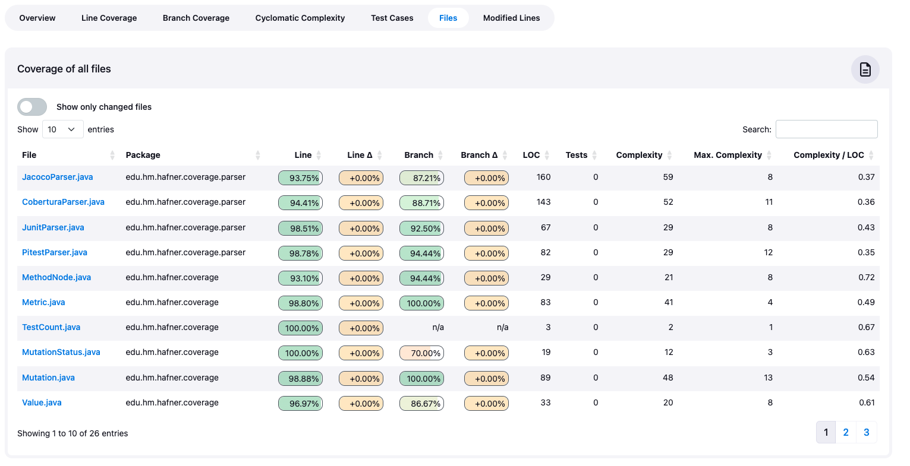
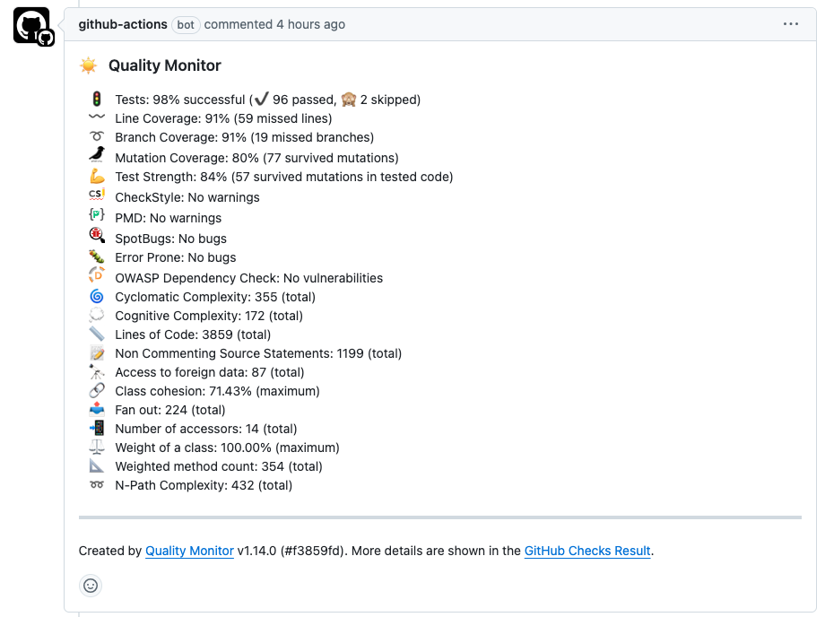

# Code coverage model 

This library Provides a Java API to parse and collect code coverage results.
It is used by my [Jenkins' coverage plug-in](https://github.com/jenkinsci/coverage-plugin) to visualize
the coverage of individual builds.

Additionally, this library is used by my additional [Quality Monitor GitHub Action](https://github.com/uhafner/quality-monitor), that monitors the quality of projects based on a configurable set of metrics and gives feedback on pull requests (or single commits) in GitHub.
There are also two additional actions available, to autograde student software projects based
on these metrics: [GitHub Autograding action](https://github.com/uhafner/autograding-github-action) and [GitLab Autograding action](https://github.com/uhafner/autograding-gitlab-action).

This library consists basically of two separate parts:

1. A model to manage several metrics in a software project. Supported metrics are code coverage (line, branch, instruction), mutation coverage, number of tests, lines of code, and cyclomatic complexity.
2. Parsers for several code coverage formats:
    * JaCoCo code coverage results
    * Cobertura code coverage results
    * PIT Mutation coverage results
    * JUnit test results

All source code is licensed under the MIT license. Contributions to this library are welcome! 
